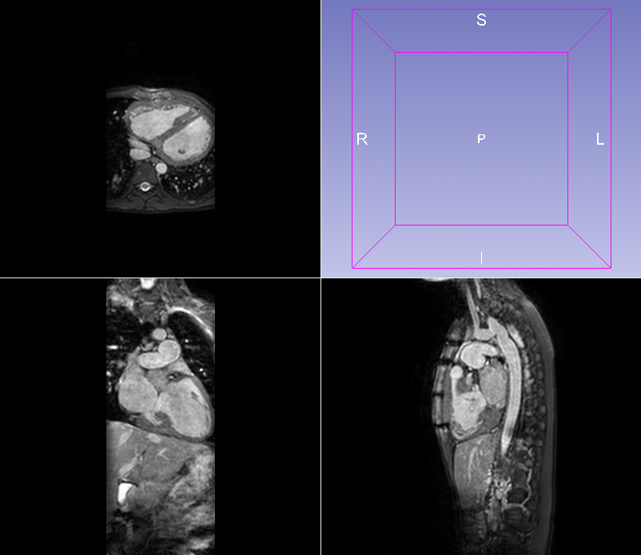
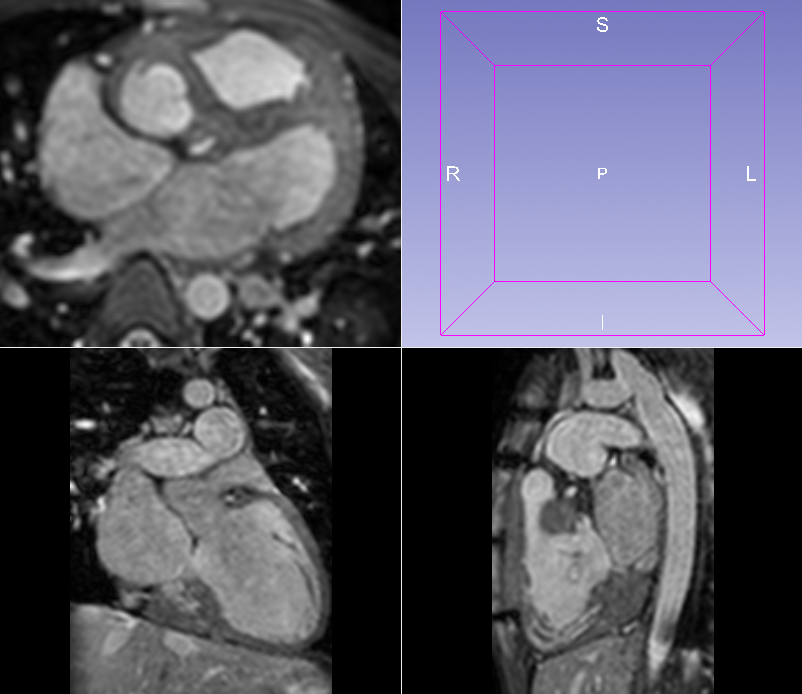
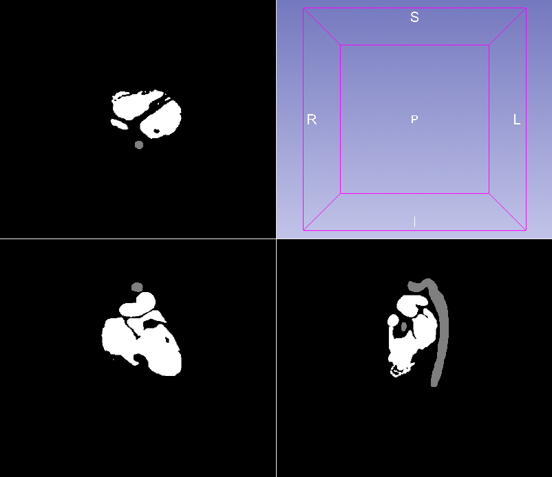

# ROI Cropping (NRRD)

Crops 2D/3D `scan.nrrd` and `mask.nrrd` pairs to the ROI defined by non-zero mask voxels, with an optional margin.

## Folder structure
data/input/<patient_folder>/*.nrrd

Files are detected by name containing `scan` and `mask`.

## Install

```bash
pip install -r requirements.txt

## Run

python src/roi_crop.py --input-dir data/input --output-dir data/output --margin 10

## Dataset

This project was tested on the HVSMR 2.0 cardiac MRI dataset.

The dataset is not included in this repository due to licensing restrictions.

## Scan Volume

| Before | After |
|--------|--------|
|  |  |

## Segmentation Mask

| Before | After |
|--------|--------|
|  | [](https://github.com/OmerFSahin/ROI-Cropping-Utilities/blob/a684de04c16c26f7492d5ebee00dc6062e347008/assets/mask_after.png) |
